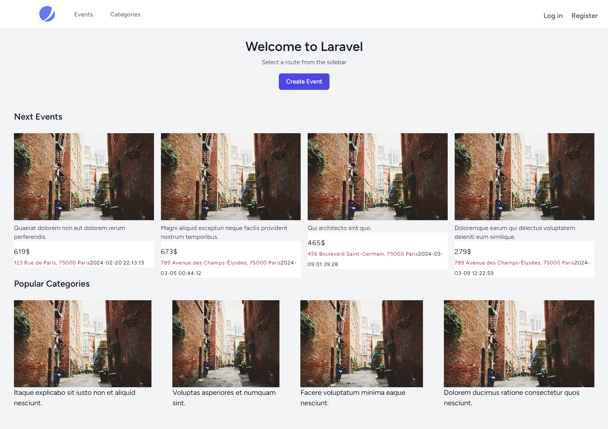
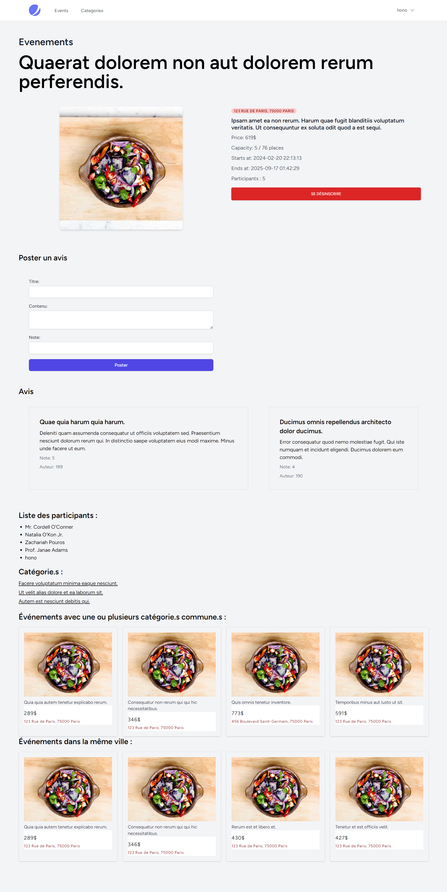
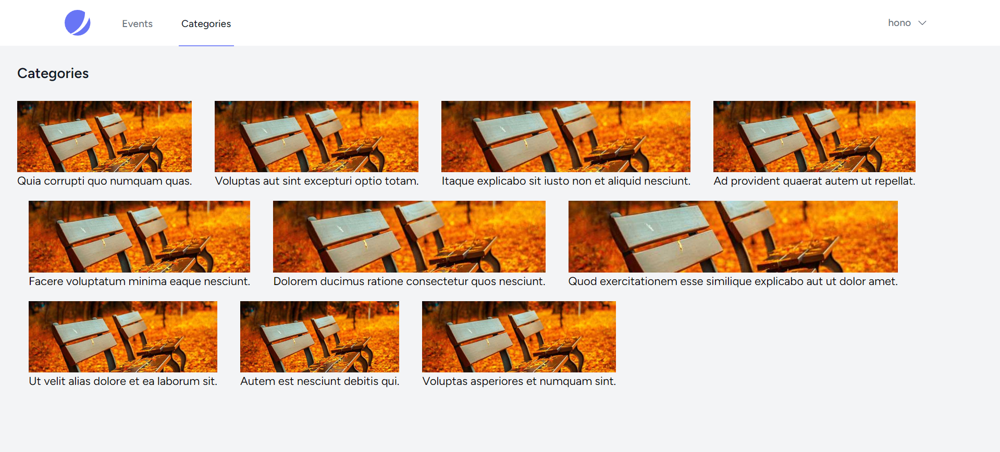
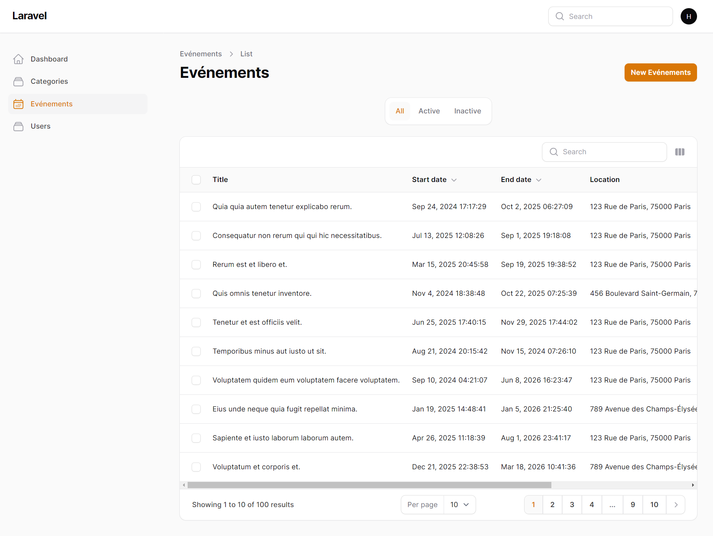

# My-Event student project

Ce projet est un travail étudiant réalisé par [HugoDemont62](https://github.com/HugoDemont62) et [Arcanoune](https://github.com/Arcanoune). Il s'agit d'une application Laravel pour la gestion d'un site d'événements.

## Contributeurs :

- [HugoDemont62](https://github.com/HugoDemont62)
- [Arcanoune](https://github.com/Arcanoune)


## Installation

Pour installer le projet, il suffit de cloner le dépôt, puis d'installer les dépendances avec composer et npm.

```bash
git clone
composer install
npm install
php artisan serve
```

## Utilisation

Pour utiliser le projet, il suffit de lancer le serveur avec la commande `php artisan serve`, puis de se rendre sur [http://127.0.0.1:8000/](http://http://127.0.0.1:8000/).


## Screenshots









